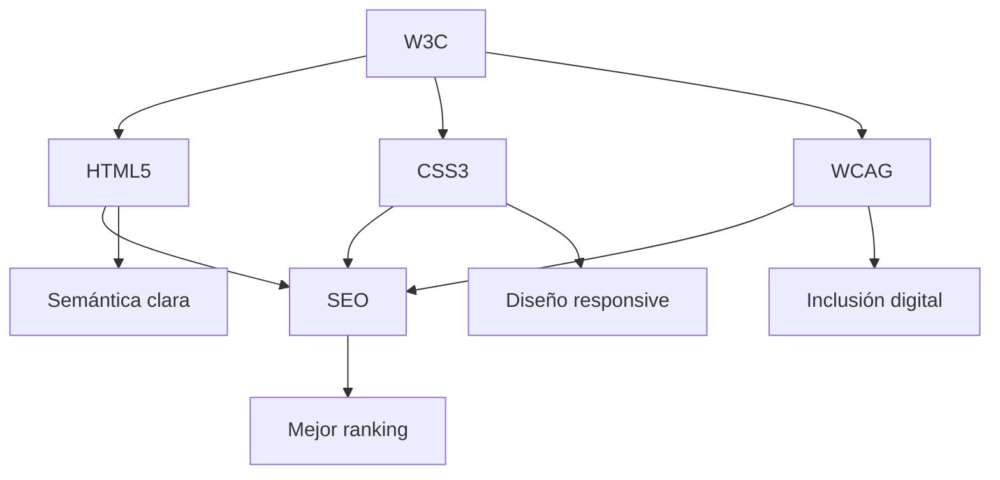

# Estándares Web: W3C, HTML5, CSS3, Accesibilidad y SEO

## 📋 Índice
1. [W3C y los Estándares Web - El Marco General](#w3c-y-los-estándares-web---el-marco-general)
2. [HTML5 y CSS3 - Estructura, Semántica y Diseño](#html5-y-css3---estructura-semántica-y-diseño)
3. [Accesibilidad Web (A11y)](#accesibilidad-web-a11y)
4. [SEO - Etiquetas Principales y Buenas Prácticas](#seo---etiquetas-principales-y-buenas-prácticas)
5. [Ejemplo Práctico Completo](#ejemplo-práctico-completo)

---

## W3C y los Estándares Web - El Marco General

### 🏛️ Definición Técnica

El **World Wide Web Consortium (W3C)** es la organización internacional que desarrolla estándares web abiertos para asegurar el crecimiento a largo plazo de la Web. Actúa como el "arquitecto jefe" de Internet, estableciendo las reglas que todos los navegadores, desarrolladores y tecnologías web deben seguir.

### 🌳 Analogía: El W3C como el "Código Civil" de Internet

Imagina que Internet es una ciudad global:
- **W3C** = El código civil que establece las leyes fundamentales
- **HTML5/CSS3** = Las normas de construcción para edificios (sitios web)
- **Accesibilidad** = Las regulaciones de acceso universal (rampas, señalización braille)
- **SEO** = Las técnicas de marketing que siguen las leyes existentes

### 📊 Jerarquía de Estándares

| Nivel                    | Rol                                                                                                                 | Ejemplo práctico                                                                  |
| ------------------------ | ------------------------------------------------------------------------------------------------------------------- | --------------------------------------------------------------------------------- |
| **W3C (marco)**          | Crea los estándares y recomendaciones técnicas para garantizar interoperabilidad.                                   | El W3C define *cómo debe funcionar* una etiqueta HTML o una propiedad CSS.        |
| **HTML5 / CSS3 / JS**    | Son **estándares derivados** aprobados y mantenidos por el W3C.                                                     | HTML5 define qué es `<header>`, CSS3 define cómo se ve, JS define cómo reacciona. |
| **Accesibilidad (WCAG)** | Es un conjunto de **directrices del W3C** para que la web sea usable por todos.                                     | Asegura que personas con discapacidad puedan navegar un sitio.                    |
| **SEO**                  | No es estándar formal del W3C, pero **usa sus estándares** correctamente para mejorar la visibilidad en buscadores. | Los buscadores "leen" etiquetas y estructura HTML definidas por el W3C.           |

### 🔧 Procesos de Estandarización

1. **Working Draft (WD)** - Borrador inicial
2. **Candidate Recommendation (CR)** - Candidato a recomendación
3. **Proposed Recommendation (PR)** - Propuesta de recomendación
4. **W3C Recommendation (REC)** - Estándar oficial

---

## HTML5 y CSS3 - Estructura, Semántica y Diseño

### 🏗️ HTML5: Definición Técnica

**HTML5** es la quinta versión del lenguaje de marcado HTML, que introduce elementos semánticos, APIs modernas y soporte multimedia nativo. Se enfoca en separar la **estructura** (HTML) del **diseño** (CSS) y del **comportamiento** (JavaScript).

### 🎨 CSS3: Definición Técnica

**CSS3** es la tercera evolución de las Hojas de Estilo en Cascada, organizada en módulos independientes que permiten animaciones, transformaciones, diseño responsivo y efectos visuales avanzados.

### 🧱 Analogía: Construcción de una Casa

```
HTML5 = Estructura (cimientos, paredes, habitaciones)
CSS3 = Decoración (pintura, muebles, iluminación)
JavaScript = Electricidad (interruptores, electrodomésticos)
```

### 📝 Elementos Semánticos Clave

#### Ejemplo del código HTML:
```html
<header>
    <nav>
        <ul>
            <li><a href="#inicio">Inicio</a></li>
            <li><a href="#servicios">Servicios</a></li>
            <li><a href="#contacto">Contacto</a></li>
        </ul>
    </nav>
</header>

<main>
    <section id="inicio">
        <h1>Ejemplo de Estándares Web</h1>
        <article>
            <h2>¿Qué son los estándares web?</h2>
            <p>Los estándares web son especificaciones técnicas...</p>
        </article>
    </section>
</main>

<aside>
    <h3>Información adicional</h3>
    <p>Enlaces relacionados y recursos extra</p>
</aside>

<footer>
    <p>&copy; 2024 Ejemplo de Estándares Web</p>
</footer>
```

**Explicación:**
- `<header>`: Define la cabecera de la página o sección
- `<nav>`: Contiene enlaces de navegación principales
- `<main>`: Marca el contenido principal único de la página
- `<section>`: Agrupa contenido temáticamente relacionado
- `<article>`: Contenido independiente y reutilizable
- `<aside>`: Información complementaria
- `<footer>`: Pie de página con información secundaria

### 🎯 CSS3 - Técnicas Modernas

#### Ejemplo del código CSS:
```css
/* Diseño responsivo */
.container {
    max-width: 1200px;
    margin: 0 auto;
    padding: 0 20px;
}

/* Flexbox para navegación */
nav ul {
    display: flex;
    justify-content: space-around;
    list-style: none;
    margin: 0;
    padding: 0;
}

/* Grid para layout principal */
.main-content {
    display: grid;
    grid-template-columns: 2fr 1fr;
    gap: 20px;
    margin: 20px 0;
}

/* Media queries para responsividad */
@media (max-width: 768px) {
    .main-content {
        grid-template-columns: 1fr;
    }
    
    nav ul {
        flex-direction: column;
    }
}
```

---

## Accesibilidad Web (A11y)

### ♿ Definición Técnica

La **Accesibilidad Web (A11y)** es la práctica de hacer que los sitios web sean utilizables por personas con discapacidades. Se basa en las **Web Content Accessibility Guidelines (WCAG) 2.1** del W3C, que establecen criterios técnicos específicos.


### Principios WCAG 2.1

1. **Perceptible** - La información debe ser presentada de formas que los usuarios puedan percibir
2. **Operable** - Los componentes de la interfaz deben ser operables
3. **Comprensible** - La información y operación de la interfaz deben ser comprensibles
4. **Robusto** - El contenido debe ser lo suficientemente robusto para ser interpretado por diversas tecnologías

### 🛠️ Técnicas de Implementación

#### Ejemplo del código HTML con accesibilidad:
```html
<!-- Texto alternativo para imágenes -->


<!-- Labels asociados a campos de formulario -->
<label for="nombre">Nombre completo:</label>
<input type="text" id="nombre" name="nombre" required 
       aria-describedby="nombre-ayuda">
<div id="nombre-ayuda">Ingrese su nombre y apellido</div>

<!-- Navegación por teclado -->
<button type="submit" 
        aria-label="Enviar formulario de contacto"
        tabindex="0">
    Enviar
</button>

<!-- Estructura de encabezados jerárquica -->
<h1>Título Principal</h1>
<h2>Sección Importante</h2>
<h3>Subsección</h3>

<!-- Contraste de colores adecuado -->
<div class="mensaje-error" role="alert" aria-live="polite">
    Error: El email no tiene un formato válido
</div>
```

###  **Explicación de atributos de accesibilidad:**

#### 🖼️ **`alt` - Texto alternativo para imágenes**

**¿Qué es?** Describe el contenido y función de una imagen para lectores de pantalla.

**En nuestro código (`index.html` línea 183):**
```html

```

**¿Por qué es importante?**
- **Lectores de pantalla:** Leen el texto alt en voz alta
- **SEO:** Google indexa el contenido de las imágenes
- **Conexión lenta:** Se muestra si la imagen no carga

**Buenas prácticas:**
```html
❌ Mal: alt="imagen1.jpg" o alt="click aquí"
✅ Bien: alt="Gráfico de barras mostrando 85% de sitios web no son accesibles"
✅ Decorativa: alt="" (cadena vacía para imágenes decorativas)
```

#### 🔗 **`aria-describedby` - Asociaciones de descripción**

**¿Qué es?** Conecta un elemento con otro que lo describe o explica.

**En nuestro código (`index.html` líneas 114-120):**
```html
<li><a href="#w3c" aria-describedby="nav-w3c">W3C</a></li>
<li><a href="#html5-css3" aria-describedby="nav-html">HTML5 y CSS3</a></li>
<!-- Tooltips ocultos para lectores de pantalla -->
<div id="nav-w3c" class="sr-only">Información sobre el World Wide Web Consortium</div>
<div id="nav-html" class="sr-only">Conceptos de HTML5 y CSS3</div>
```

**También en formularios (`index.html` líneas 333-341):**
```html
<label for="nombre">Nombre completo <span aria-label="campo requerido">*</span>:</label>
<input type="text" id="nombre" name="nombre" required 
       aria-describedby="nombre-ayuda" aria-invalid="false">
<div id="nombre-ayuda" class="help-text">
    Ingrese su nombre y apellido
</div>
```

**¿Cómo funciona?**
- El lector de pantalla lee: "Enlace W3C, Información sobre el World Wide Web Consortium"
- Proporciona contexto adicional sin saturar la interfaz visual

#### 🏷️ **`aria-label` - Etiquetas accesibles**

**¿Qué es?** Proporciona un nombre accesible cuando el texto visible no es suficientemente descriptivo.

**En nuestro código (`index.html` líneas múltiples):**
```html
<!-- Navegación principal (línea 105) -->
<nav role="navigation" aria-label="Navegación principal">

<!-- Breadcrumb (línea 142) -->
<nav aria-label="Breadcrumb" class="breadcrumb">

<!-- Botón de skip link (línea 98) -->
<a href="#main-content" class="skip-link">Saltar al contenido principal</a>

<!-- Campo requerido (línea 333) -->
<span aria-label="campo requerido">*</span>

<!-- Botón volver arriba (línea 736) -->
<a href="#top" aria-label="Volver al inicio de la página">
    <span aria-hidden="true">↑</span> Ir arriba
</a>
```

**¿Cuándo usarlo?**
- **Iconos sin texto:** Botones que solo tienen íconos
- **Campos requeridos:** Asteriscos y símbolos
- **Navegación múltiple:** Distinguir entre diferentes menús
- **Enlaces genéricos:** "Leer más", "Click aquí"

#### ⚡ **`tabindex` - Control de navegación por teclado**

**¿Qué es?** Controla el orden y la capacidad de enfoque de los elementos.

**Valores posibles:**
- **`tabindex="0"`**: Elemento enfocable en orden natural
- **`tabindex="-1"`**: Elemento enfocable solo programáticamente
- **`tabindex="1, 2, 3..."`**: Orden específico (NO recomendado)


**🔄 Orden natural de TAB (sin tabindex explícito):**

1. **Elementos interactivos nativos (orden en HTML):**
   ```html
   1. <a href="#main-content">Skip link</a>
   2. <a href="#w3c">W3C</a>
   3. <a href="#html5-css3">HTML5 y CSS3</a>
   4. <a href="#accesibilidad">Accesibilidad</a>
   5. <a href="#seo">SEO</a>
   6. <input type="text" id="nombre">
   7. <input type="email" id="email">
   8. <input type="radio" id="principiante">
   9. <button type="submit">Enviar</button>
   10. <a href="https://www.w3.org/">W3C Website</a>
   ```

**🎯 ¿Cómo configuramos el orden de TAB?**

**Por defecto (recomendado):** El orden sigue la estructura HTML
```html
<!-- El TAB sigue este orden automáticamente -->
<header>
    <nav>
        <a href="#w3c">W3C</a>          <!-- TAB 1 -->
        <a href="#html5">HTML5</a>      <!-- TAB 2 -->
    </nav>
</header>
<main>
    <input type="text">                 <!-- TAB 3 -->
    <button>Enviar</button>             <!-- TAB 4 -->
</main>
```

**Personalizado (cuando sea necesario):**
```html
<!-- Solo usar en casos específicos -->
<button tabindex="0">Primero</button>     <!-- Orden natural -->
<div tabindex="-1">No en TAB</div>        <!-- Solo programático -->
<button tabindex="0">Segundo</button>     <!-- Orden natural -->
```

**⚠️ NUNCA hacer esto:**
```html
❌ <button tabindex="3">Tercero</button>
❌ <button tabindex="1">Primero</button>
❌ <button tabindex="2">Segundo</button>
```
*Rompe la lógica de navegación y confunde a los usuarios*

#### 🚨 **`role="alert"` - Contenido importante**

**¿Qué es?** Indica que el contenido es crítico y debe anunciarse inmediatamente.

**En nuestro código (`index.html` línea 425):**
```html
<div id="form-status" 
     role="status" 
     aria-live="polite" 
     aria-atomic="true" 
     class="sr-only">
    <!-- Los mensajes aparecerán aquí dinámicamente -->
</div>
```

**Cuándo usar `role="alert"` vs `role="status"`:**
```html
<!-- Para errores críticos -->
<div role="alert">Error: La contraseña es incorrecta</div>

<!-- Para información general -->
<div role="status">Guardado automáticamente</div>
```

#### 🔄 **`aria-live` - Notificaciones dinámicas**

**¿Qué es?** Notifica a lectores de pantalla sobre cambios en el contenido.

**Valores:**
- **`aria-live="polite"`**: Espera a que el usuario termine su actividad
- **`aria-live="assertive"`**: Interrumpe para anunciar inmediatamente
- **`aria-live="off"`**: No anuncia cambios (predeterminado)

**En nuestro código implementado en JavaScript (`script.js`):**
```javascript
// Ejemplo de uso dinámico
function showSuccessMessage(message) {
    const statusElement = document.getElementById('form-status');
    statusElement.textContent = message;
    // El aria-live="polite" hace que se anuncie automáticamente
}
```

**Ejemplo práctico del flujo completo:**
```html
<!-- HTML inicial -->
<div id="form-status" 
     role="status" 
     aria-live="polite" 
     aria-atomic="true" 
     class="sr-only">
</div>

<!-- Cuando el usuario envía el formulario -->
<script>
// JavaScript actualiza el contenido
document.getElementById('form-status').textContent = 
    "Formulario enviado correctamente";
// El lector de pantalla anuncia: "Formulario enviado correctamente"
</script>
```

### 🎹 **Navegación por teclado completa en nuestro proyecto:**

**Teclas soportadas:**
- **TAB**: Avanza al siguiente elemento
- **SHIFT + TAB**: Retrocede al elemento anterior  
- **ENTER**: Activa enlaces y botones
- **SPACE**: Activa botones y checkboxes
- **ARROW KEYS**: Navegación en radio buttons y menús

**Flujo de navegación en nuestro `index.html`:**
```
1. Skip Link → 2. Nav W3C → 3. Nav HTML5 → 4. Nav A11y → 5. Nav SEO →
6. Breadcrumb Inicio → 7. Breadcrumb Cursos → 8. Campo Nombre →
9. Campo Email → 10. Radio Principiante → 11. Radio Intermedio →
12. Radio Avanzado → 13. Botón Enviar → 14. Enlaces Sidebar →
15. Volver Arriba
```

### **Probando la accesibilidad:**

**Con teclado:**
1. **Presiona TAB** para navegar por elementos
2. **SHIFT + TAB** para retroceder
3. **ENTER** en enlaces
4. **SPACE** en botones

**Con lector de pantalla (simulado):**
```
"Enlace, Saltar al contenido principal"
"Navegación principal, lista con 4 elementos"
"Enlace, W3C, Información sobre el World Wide Web Consortium"
"Campo de texto, Nombre completo, campo requerido, Ingrese su nombre y apellido"
```

**Herramientas de validación:**
- **WAVE Web Accessibility Evaluator**
- **axe DevTools** (extensión de navegador)
- **Lighthouse** (auditoría de accesibilidad)
- **Navegación solo con teclado** (TAB, ENTER, SPACE)

### 🎯 **Resumen de implementación en nuestro proyecto:**

| Técnica | Ubicación en código | Beneficio |
|---------|-------------------|-----------|
| `alt` descriptivo | Línea 183 | Imágenes accesibles |
| `aria-describedby` | Líneas 114-120, 333-341 | Contexto adicional |
| `aria-label` | Líneas 105, 142, 736 | Etiquetas claras |
| `tabindex` natural | Todo el documento | Navegación lógica |
| `role="status"` | Línea 425 | Feedback accesible |
| `aria-live="polite"` | Línea 425 | Updates no intrusivos |

---

## SEO - Etiquetas Principales y Buenas Prácticas

###  Definición Técnica

**SEO (Search Engine Optimization)** es la práctica de optimizar sitios web para mejorar su visibilidad en los resultados de búsqueda orgánica. Aunque no es un estándar W3C formal, depende completamente de usar correctamente los estándares HTML establecidos por el W3C.


### Etiquetas Fundamentales

#### Ejemplo del código HTML con SEO:
```html
<!DOCTYPE html>
<html lang="es">
<head>
    <!-- Título optimizado (50-60 caracteres) -->
    <title>Estándares Web W3C: HTML5, CSS3 y Accesibilidad | Guía 2024</title>
    
    <!-- Meta descripción (150-160 caracteres) -->
    <meta name="description" 
          content="Aprende los estándares web del W3C: HTML5 semántico, CSS3 moderno, accesibilidad WCAG y mejores prácticas SEO. Guía técnica completa.">
    
    <!-- Canonical URL -->
    <link rel="canonical" href="https://ejemplo.com/estandares-web">
    
    <!-- Datos estructurados JSON-LD -->
    <script type="application/ld+json">
    {
        "@context": "https://schema.org",
        "@type": "Article",
        "headline": "Guía Completa de Estándares Web W3C",
        "author": {
            "@type": "Person",
            "name": "Pablo Torres"
        },
        "datePublished": "2024-10-28",
        "dateModified": "2024-10-28",
        "description": "Aprende los estándares web del W3C: HTML5, CSS3, accesibilidad y SEO",
        "mainEntityOfPage": "https://ejemplo.com/estandares-web",
        "publisher": {
            "@type": "Organization",
            "name": "Universidad Politecnica Salesiana - Ciencias de la Computación"
        }
    }
    </script>
</head>
```

### 🔗 **CANONICAL URL - Control de Contenido Duplicado**

#### ¿Qué es y por qué lo ponemos?

La **etiqueta canonical** es como el "DNI oficial" de una página web. Le dice a Google: *"Esta es la versión verdadera y oficial de este contenido"*.

```html
<link rel="canonical" href="https://ejemplo.com/estandares-web">
```

#### 🎯 **¿Por qué es crucial para SEO?**

**Problema sin canonical:**
```
Tu página puede ser accesible desde múltiples URLs:
- https://ejemplo.com/estandares-web
- https://ejemplo.com/estandares-web?utm_source=facebook
- https://www.ejemplo.com/estandares-web
- https://ejemplo.com/estandares-web/
- https://ejemplo.com/estandares-web#seccion1
```

**Google ve estas como páginas diferentes** → Divide el "poder SEO" → Peor posicionamiento

**Solución canonical:**
```html
<!-- Todas las versiones apuntan a una sola URL "oficial" -->
<link rel="canonical" href="https://ejemplo.com/estandares-web">
```

#### 📊 **Beneficios técnicos:**

1. **Consolida Link Equity**: Todo el "juice" de enlaces va a una sola URL
2. **Evita penalizaciones**: Google no ve contenido duplicado
3. **Mejora crawling**: Los bots no pierden tiempo en URLs duplicadas
4. **Concentra métricas**: Analytics más precisos

#### ⚡ **Analogía práctica:**
```
Sin canonical = 5 personas con el mismo CV aplicando al mismo trabajo
Con canonical = 1 persona con CV consolidado y fuerte
```

### 📊 **JSON-LD - Datos Estructurados para Buscadores**

#### ¿Qué es y por qué lo usamos?

**JSON-LD** es como "etiquetar" tu contenido para que Google lo entienda perfectamente. Es el lenguaje que usas para "hablar" directamente con los motores de búsqueda.

```json
{
    "@context": "https://schema.org",
    "@type": "Article",
    "headline": "Guía Completa de Estándares Web W3C",
    "author": {
        "@type": "Person",
        "name": "Pablo Torres"
    },
    "datePublished": "2024-10-28",
    "dateModified": "2024-10-28",
    "description": "Aprende los estándares web del W3C: HTML5, CSS3, accesibilidad y SEO",
    "mainEntityOfPage": "https://ejemplo.com/estandares-web",
    "publisher": {
        "@type": "Organization",
        "name": "Universidad Politecnica Salesiana - Ciencias de la Computación"
    }
}
```

#### 🎯 **¿Por qué ponemos cada campo?**

| Campo | ¿Para qué sirve? | Beneficio SEO |
|-------|------------------|---------------|
| `"@context": "https://schema.org"` | Define el "diccionario" que usamos | Google entiende el vocabulario estándar |
| `"@type": "Article"` | Le dice a Google "esto es un artículo" | Puede aparecer en resultados de noticias/artículos |
| `"headline"` | Título principal del contenido | Aparece en rich snippets y knowledge panel |
| `"author"` | Quién escribió el artículo | Construye autoridad y credibilidad |
| `"datePublished"` | Cuándo se publicó | Google muestra fechas en resultados |
| `"dateModified"` | Última actualización | Indica contenido fresco y actualizado |
| `"description"` | Resumen del contenido | Puede usarse como snippet en resultados |
| `"mainEntityOfPage"` | URL oficial del artículo | Conecta con canonical URL |
| `"publisher"` | Organización que publica | Construye confianza y autoridad de marca |

#### 🚀 **Beneficios prácticos del JSON-LD:**

**1. Rich Snippets (Fragmentos Enriquecidos):**
```
Resultado normal: Título + URL + descripción
Con JSON-LD: Título + URL + descripción + fecha + autor + ⭐ calificación
```

**2. Knowledge Graph:**
```
Google puede usar tu contenido para responder preguntas directamente:
"¿Qué son los estándares web?" → Tu artículo aparece en el panel de respuestas
```

**3. Voice Search Optimization:**
```
Asistente: "¿Qué es el W3C?"
Google: "Según el artículo de Universidad PRW-P67, el W3C es..."
```

**4. Featured Snippets:**
```
Tu contenido puede aparecer en la "posición 0" de Google
```


**Sin structured data:**
```
Google: "Veo texto sobre W3C... ¿será un artículo? ¿una noticia? ¿quién lo escribió?"
```

**Con JSON-LD:**
```
Google: "Perfecto! Es un artículo educativo sobre W3C, escrito por Pablo Torres el 28/10/2024, 
actualizado hoy. Lo catalogaré como contenido técnico de alta calidad."
```

#### 📈 **Impacto real en SEO:**

- **CTR +30%**: Rich snippets atraen más clics
- **Mejor ranking**: Google entiende mejor tu contenido
- **Apariciones especiales**: Featured snippets, knowledge panels
- **Voice search ready**: Optimizado para búsquedas por voz

#### ⚠️ **Errores comunes que evitamos:**

❌ **Mal:**
```json
{
    "@type": "Article",
    "headline": "Título súper largo de más de 110 caracteres que Google cortará...",
    "datePublished": "28/10/2024",  // Formato incorrecto
    "author": "Estudiante"  // Falta estructura Person
}
```

✅ **Bien:**
```json
{
    "@context": "https://schema.org",
    "@type": "Article",
    "headline": "Estándares Web W3C - Guía 2024",  // < 110 caracteres
    "datePublished": "2024-10-28",  // Formato ISO correcto
    "author": {
        "@type": "Person",
        "name": "Pablo Torres"
    }
}
```

### 🔄 **Canonical + JSON-LD = Combo Perfecto**

```html
<!-- Canonical dice: "Esta es la URL oficial" -->
<link rel="canonical" href="https://ejemplo.com/estandares-web">

<!-- JSON-LD dice: "Este es el contenido oficial de esa URL" -->
<script type="application/ld+json">
{
    "@context": "https://schema.org",
    "@type": "Article",
    "mainEntityOfPage": "https://ejemplo.com/estandares-web"  // ¡Misma URL!
}
</script>
```

**Resultado:** Google tiene 100% claridad sobre qué URL indexar y cómo interpretar el contenido.


### 📱 **Otras etiquetas SEO importantes del código:**

```html
<!-- Open Graph para redes sociales -->
<meta property="og:title" content="Estándares Web W3C - Guía Completa">
<meta property="og:description" 
      content="Domina HTML5, CSS3, accesibilidad y SEO con ejemplos prácticos">
<meta property="og:image" content="https://ejemplo.com/imagen-preview.jpg">
<meta property="og:url" content="https://ejemplo.com/estandares-web">
<meta property="og:type" content="article">

<!-- Twitter Cards -->
<meta name="twitter:card" content="summary_large_image">
<meta name="twitter:title" content="Estándares Web W3C - Guía Completa">
<meta name="twitter:description" 
      content="Domina HTML5, CSS3, accesibilidad y SEO con ejemplos prácticos">

<!-- Viewport para responsive -->
<meta name="viewport" content="width=device-width, initial-scale=1.0">
```

**Explicación de etiquetas SEO:**

- **`<title>`**: Título que aparece en resultados de búsqueda (50-60 caracteres)
- **`meta description`**: Resumen que aparece bajo el título en Google (150-160 caracteres)
- **`meta robots`**: Instrucciones para bots de búsqueda (index/noindex, follow/nofollow)
- **`rel="canonical"`**: Indica la URL preferida para evitar contenido duplicado
- **Open Graph**: Metadatos para compartir en redes sociales
- **JSON-LD**: Datos estructurados que ayudan a los buscadores a entender el contenido
- **`aria-label`**: Mejora accesibilidad y contexto para buscadores

### 📈 Buenas Prácticas SEO Técnicas

1. **URL semánticas**: `/estandares-web/html5-css3` (no `/page.php?id=123`)
2. **Jerarquía de encabezados**: H1 → H2 → H3 (sin saltar niveles)
3. **Texto alternativo descriptivo**: Describe función, no apariencia
4. **Velocidad de carga**: Optimizar imágenes, minificar CSS/JS
5. **Diseño responsivo**: Mobile-first approach
6. **HTTPS**: Protocolo seguro es factor de ranking

---

## Ejemplo Práctico Completo

El archivo `index.html` en este proyecto demuestra cómo todos estos conceptos trabajan juntos:

### 🔗 Conexiones entre Estándares



### 📁 Archivos del Proyecto

- **`index.html`**: Ejemplo completo con todas las técnicas
- **`styles.css`**: CSS3 moderno con Grid y Flexbox
- **`script.js`**: JavaScript para interactividad accesible
- **`README.md`**: Esta documentación técnica

### 🎯 Beneficios de Seguir Estándares

1. **Interoperabilidad**: Funciona en todos los navegadores
2. **Mantenibilidad**: Código más limpio y predecible
3. **SEO mejorado**: Mejor posicionamiento en buscadores
4. **Accesibilidad**: Inclusión de todos los usuarios
5. **Futuro-proof**: Compatibilidad con tecnologías emergentes

---

## 📚 Recursos Adicionales

- [W3C Official Website](https://www.w3.org/)
- [HTML5 Specification](https://html.spec.whatwg.org/)
- [CSS3 Modules](https://www.w3.org/Style/CSS/)
- [WCAG 2.1 Guidelines](https://www.w3.org/WAI/WCAG21/quickref/)
- [Google SEO Guidelines](https://developers.google.com/search/docs)

---

**💡 Recuerda**: Los estándares web no son restricciones, son las **mejores prácticas** que garantizan que tu sitio web sea **accesible**, **encontrable** y **futuro-proof**.